# Menus Jeedom

Développements de menus pour Jeedom

### :boom: [Installation automatique](./installation) d'un menu noodom à l'aide d'un scénario créé automatiquement

Cette installation permet de créer les différents menus ci-dessous automatiquement à partir d'un simple scénario.

## Liste des menus

<!--
## Menu [F$B33](./jsonFsb33) avec fichier de configuration JSon

Ce menu reprend le menu F$B33 en ajoutant la gestion des boutons par un paramétrage à partir d'un fichier JSon

⚠️ Version du menu non maintenue : privilégier la version ci-dessous avec gestion par Frame
-->

### :boom: Menu [F$B33](./menuJsonFsb33Frame) avec fichier de configuration JSon et navigation par Frame

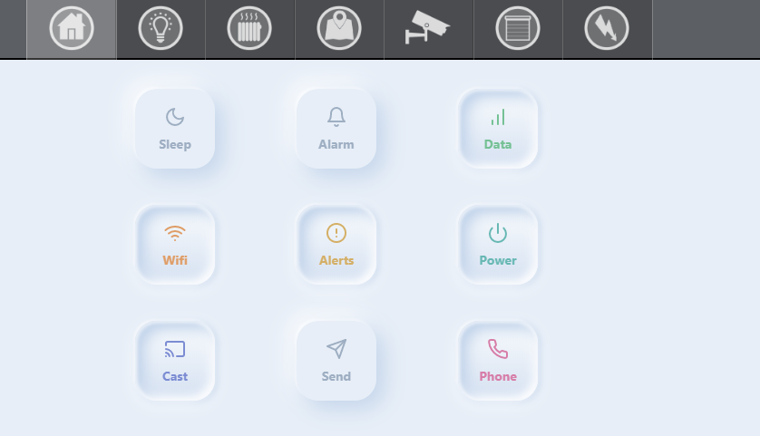

Ce menu reprend le menu F$B33 en ajoutant la gestion des boutons par un paramétrage JSon et une navigation par Frame

### :boom: Menu [Nav Button](./menuNavButton) avec fichier de configuration JSon et navigation par Frame

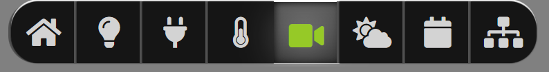

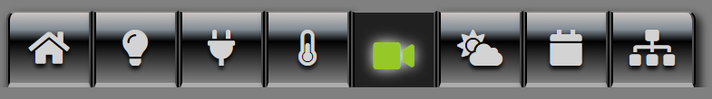

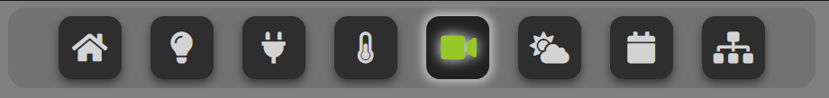

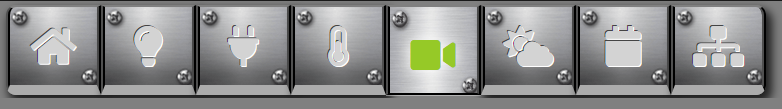

Ce menu permet de créer différents types de menus en sélectionnant un des css à disposition et en le personnalisation à l'aide du paramétrage JSon et une navigation par Frame

### :boom: Menu [nooNeumorphism](./menuNooNeumorphism) avec fichier de configuration JSon et navigation par Frame
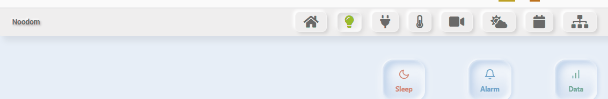

Ce menu affiche un menu de style neumorphique.

### :boom: Menu [3D Anim](./menuNoo3DAnim) avec fichier de configuration JSon et navigation par Frame

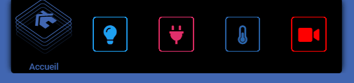

Ce menu affiche des boutons 3D avec une animation sur focus pour le bouton sélectionné, les boutons du menu ayant chacun une couleur personnalisable.

Il permet une configuration par un fichier Json et une navigation par Frame.

### :boom: Menu [Sliding](./menuNooSliding) avec fichier de configuration JSon et navigation par Frame

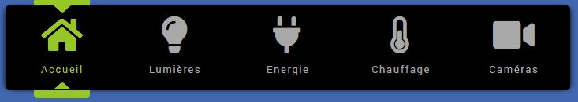

Ce menu encadre le bouton sélectionné et suit la souris avec une encoche autour du bouton courant.

Il permet une configuration par un fichier Json et une navigation par Frame.

### :boom: Menu [Animation](./menuAnimation) avec fichier de configuration JSon et navigation par Frame

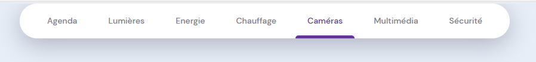

Ce menu affiche les boutons du menu avec une couleur personnalisable pour chacun.

Il permet une configuration par un fichier Json et une navigation par Frame.

### :boom: Menu [VerticalTom](./menuVerticalTom) avec fichier de configuration JSon et navigation par Frame
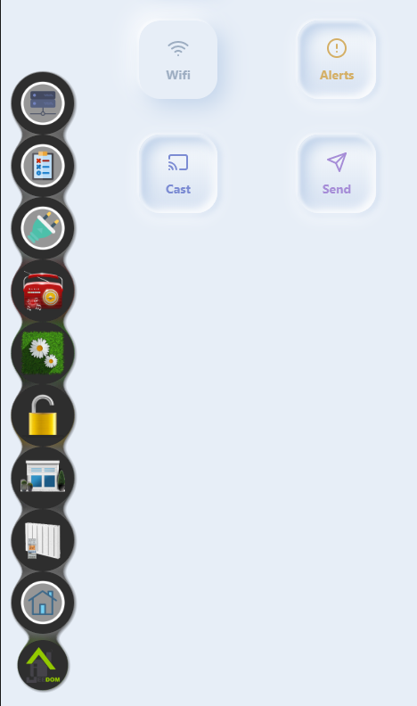

Ce menu affiche un menu vertical s'ouvrant de bas en haut. Il offre le choix par paramétrage de se refermer automatiquement après sélection d'un bouton. 

### :boom: Menu [menuNoo3DRound](./menuNoo3DRound) avec fichier de configuration JSon et navigation par Frame
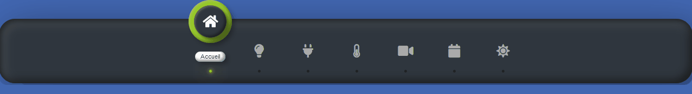

Ce menu affiche le logo en 3D du bouton sélectionné et affiche son nom en relief. 

### :boom: Menu [MobileSubMenuFrame](./menuMobileSubMenuFrame) avec fichier de configuration JSon et navigation par Frame
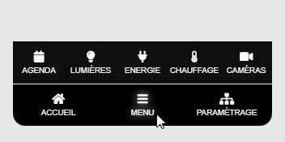

Ce menu affiche un menu en bas d'écran pour mobile. 

Il affiche un bouton "Menu" au centre et 2 boutons de liens vers des designs à gauche et à droite de ce bouton.

La sélection du bouton Menu affiche une nouvelle ligne de 5 boutons permettant l'affichage de nouveaux designs.

Ce menu reprend le menu MobileSubMenu en ajoutant une navigation par Frame.

### :boom: Menu [NooMobileFlip](./menuNooMobileFlip) avec fichier de configuration JSon et navigation par Frame
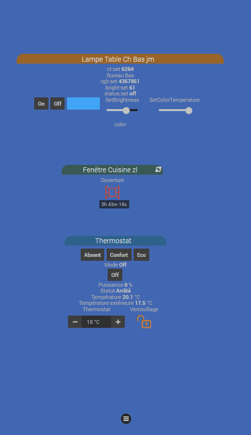

Ce menu affiche un menu en bas d'écran pour mobile. 

Il s'affiche sur sélection du bouton Hamburger, s'ouvre par le bas en décalant le contenu vers le haut.
La gestion de son paramétrage est assurée par fichier JSon et sa navigation par frame.

### :boom: Menu [Floating Draggable](./menuFloattingDraggable) avec fichier de configuration JSon et navigation par Frame

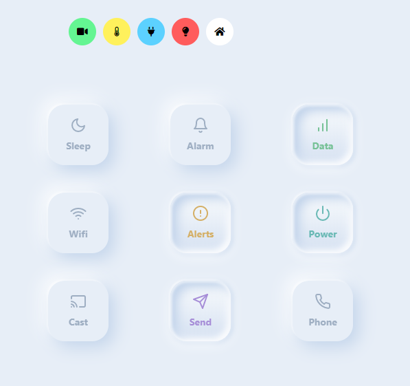

Ce menu affiche un bouton principal déplaçable à la souris et affichant les autres boutons sur sélection. Le logo et la couleur de fond sont personnalisables pour chacun.

Il permet une configuration par un fichier Json et une navigation par Frame.

### :boom: Menu [InTheAir](./menuInTheAir) avec fichier de configuration JSon et navigation par Frame

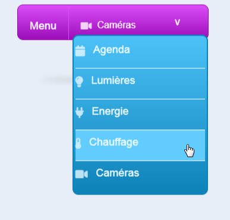

Ce menu affiche un simple menu en suspension.

Il permet une configuration par un fichier Json et une navigation par Frame.

### :boom: Menu [HoverShow](./menuHoverShow) avec fichier de configuration JSon

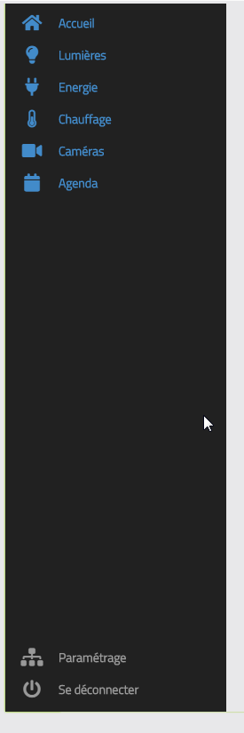

Ce menu affiche un menu vertical sur la gauche de l'écran d'écran. Il affiche un menu haut et un menu bas. Chaque bouton du menu lance l'affichage d'un nouvel écran de Design.

<!--
### Menu [MobileSubMenu](./menuMobileSubMenu) avec fichier de configuration JSon

Ce menu affiche un menu en bas d'écran pour mobile. 

Il affiche un bouton "Menu" au centre et 2 boutons de liens vers des designs à gauche et à droite de ce bouton.

La sélection du bouton Menu affiche une nouvelle ligne de 5 boutons permettant l'affichage de nouveaux designs.
-->
