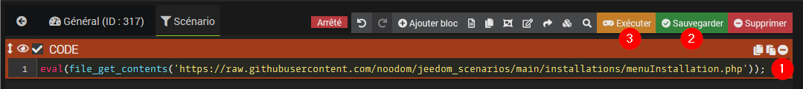
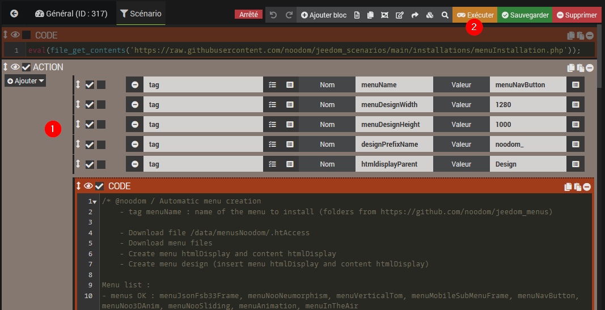
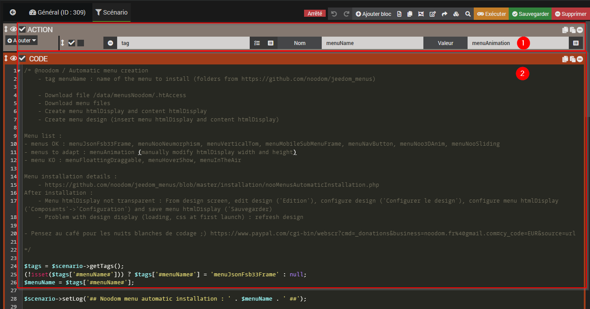
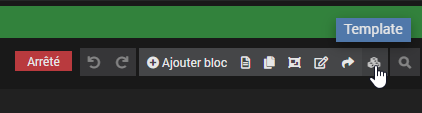
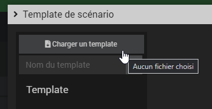
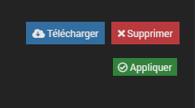
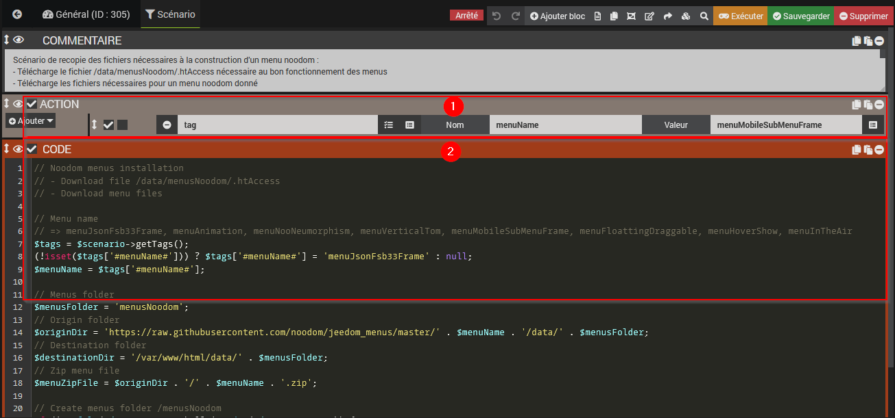

Vous trouverez ci-dessous 3 méthodes pour installer mes différents menus proposés 
(Définition des méthodes dans l'ordre de préconisation)

1. Méthode de création automatique du menu nécessaire pour générer automatiquement des scénarios (**Préconisée**)
2. Méthode de création manuelle du scénario pour générer automatiquement des scénarios
3. Méthode d'installation manuelle d'un menu noodom

# Installation automatique d'un menu noodom à l'aide d'un scénario créé automatiquement

- Créer un scénario
- Ajouter un bloc-code avec le contenu suivant, sauvegarder le scénario et l'exécuter :

**eval(file_get_contents('https://raw.githubusercontent.com/noodom/jeedom_scenarios/main/installations/menuInstallation.php'));**



- Rafraichir le scénario et on retrouve le scénario de génération automatique dans ce même scénario



- Renseigner les tags **menuName** (nom du menu à générer), **menuDesignWidth** (largeur du design), **menuDesignHeight** (hauteur du design), **designPrefixName** (préfixe du nom de menu : pour générer plusieurs menus identiques), **htmldisplayParent** (Définition de l'objet parent du design) selon le menu à générer et exécuter à nouveau le scénario

-  Le scénario précisé est automatiquement généré dans la liste des designs Jeedom !

>**Note** :
> - les tags **menuDesignWidth** et **menuDesignHeight** corerspondent au design du menu comprenant les 2 htmlDisplay nécessaires à son utilisation (ils faut donc veiller à respecter la correspondance de ces tailles avec le paramétrage du menu défini dans le fichier de configuration du menu (perso.json)
> - le tag **designPrefixName** est facultatif : utile pour générer un même menu avec des configurations différentes (pour diférentes plateformes par exemple)
> - le tag **htmldisplayParent** détermine l'objet parent des htmlDisplay ("Aucun" si non défini).

# Installation automatique d'un menu noodom  à l'aide d'un scénario créé manuellement

Cette installation permet de créer les différents menus automatiquement à partir du scénario suivant.



1️⃣ 1. Créer un nouveau scénario

2️⃣ Ajouter une action tag menuName nomDuMenu

3️⃣ Ajouter un bloc-code et copier le code 

4️⃣ Exécuter le scénario

5️⃣ Le menu est généré automatiquement : 

   - il est visible dans la liste des designs
   - il est accessible directement dans la liste des messages (liens du design et des htmlDisplays du menu et du contenu disponibles dans le message JEedom créé à la génération)

:warning: Menus compatibles :
- L'installation est possible pour les menus suivants : **menuJsonFsb33Frame**, **menuNooNeumorphism**, **menuVerticalTom**, **menuMobileSubMenuFrame**, **menuNavButton**, **menuNoo3DAnim**, **menuNooSliding**, **menuAnimation**, **menuInTheAir**.
- Si le menu n'est pas transparent, il faut effectuer les actions suivantes depuis le design du menu : Clic droit, Sélectionner `Edition`, Clic droit, `Configurer le design`, puis sélectionner `Composants`, `Configuration` du menu (2ème ligne) et `Sauvegarder`.
- En cas de problème d'affichage après génération (chargement, problème de CSS), rafraichir la page du design

# Installation manuelle d'un menu noodom

:warning: Avec la nouvelle installation automatique proposée ci-dessus, cette méthode n'est plus nécessaire.

:warning: Cette installation est nécessaire pour une compatibilité avec les nouvelles sécurités de Jeedom (et donc pour des menus compatibles Jeedom 4.2)

:warning: Les anciennes versions des menus installés dans le répertoire /html/montheme ne seront plus compatibles avec les nouvelles sécurités de Jeedom

La première étape d'installation d'un menu consiste à copier les fichiers nécessaires à son exécution.
Pour cela, il suffit d'exécuter le scénario [nooMenusFilesDownload](nooMenusFilesDownload.json) qui s'occupera de la recopie de ces fichiers.

Il faut alors suivre les étapes suivantes :

1️⃣ Télécharger le template du scénario disponible ici : [nooMenusFilesDownload](nooMenusFilesDownload.json)
2️⃣ Charger le scénario depuis Jeedom à partir du fichier de template du scénario

  - Sélectionner le menu `Outils` / `Scénarios`
  - Sélectionner `Ajouter` pour créer un nouveau scénario, lui donner un nom
  - Sélectionner le bouton `Template`

    

  - Sélectionner "`Charger un template"` et sélectionner le fichier json du template de scénario

    

3️⃣ Appliquer le template chargé au scénario en cours de création

  - Sélectionner le template présent dans la liste des templates
  - Sélectionner le bouton `Appliquer` pour charger le template dans le scénario en cours de création

    

4️⃣ Exécution du scénario
  - Le nouveau scénario créé contient le contenu du template chargé
  - Dans le contenu du scénario, préciser le nom du menu à installer au niveau du tag `menuName`

    (valeurs possibles actuellement : **menuJsonFsb33Frame**, **menuNooSliding**, **menuNoo3DAnim**, **menuAnimation**, **menuNooNeumorphism**, **menuVerticalTom**, **menuMobileSubMenuFrame**, **menuFloattingDraggable**, **menuHoverShow**, **menuInTheAir**)
  - Exécuter le scénario


=> Les fichiers nécessaires à l'exécution du menu sont présents dans le répertoire **/html/data/menusNoodom/menuName**

>**Note** : En cas de problème d'import du template, ci-dessous une capture du scénario final avec le code à insérer dans le bloc-code
>
>Attention à bien renseigner le nom du menu souhaité dans le tag **menuName**

**Capture du scénario d'installation**



**Bloc-Code du scénario d'installation**

```// Noodom menus installation
// - Download file /data/menusNoodom/.htAccess
// - Download menu files
  
// Menu name
// => menuJsonFsb33Frame, menuAnimation, menuNooNeumorphism, menuVerticalTom, menuMobileSubMenuFrame, menuFloattingDraggable, menuHoverShow, menuInTheAir
$tags = $scenario->getTags();
(!isset($tags['#menuName#'])) ? $tags['#menuName#'] = 'menuJsonFsb33Frame' : null;
$menuName = $tags['#menuName#']; 

// Menus folder
$menusFolder = 'menusNoodom';
// Origin folder
$originDir = 'https://raw.githubusercontent.com/noodom/jeedom_menus/master/' . $menuName . '/data/' . $menusFolder; 
// Destination folder
$destinationDir = '/var/www/html/data/' . $menusFolder;
// Zip menu file
$menuZipFile = $originDir . '/' . $menuName . '.zip'; 

// Create menus folder /menusNoodom
if (!is_file($destinationDir) && !is_dir($destinationDir)) {
  $scenario->setLog('Destination dir creation (menus folder) : ' . $destinationDir);
  mkdir($destinationDir);
}

// Get .htaccess file
if (is_dir($destinationDir) . '/.') {
  $scenario->setLog('** Get .htaccess file');
  $originUrl = $originDir . '/.htaccess';

  $filename = basename($originUrl); 
  $save = $destinationDir . '/' . $filename;
  $scenario->setLog('- Origin filename : ' . $originUrl);
  $scenario->setLog('- Destination filename : ' . $save);
  if (file_put_contents($save,file_get_contents($originUrl))) {
    $scenario->setLog('- .htaccess downloaded !');
  }
}

// Get menu files
$destinationMenu = $destinationDir . '/' .$menuName;
if (is_dir($destinationMenu . '/.')) {
  // Delete existing menu folder
  $scenario->setLog('** Delete existing menu folder : ' . $destinationMenu);
  rrmdir($destinationMenu);
}

if (is_dir($destinationDir)) {
  $scenario->setLog('** Get files for menu ' . $menuName);
  $scenario->setLog('- Get menu zip file : ' . $menuZipFile);
  $destination = $destinationDir . '/temp.zip';
  $scenario->setLog('- Destination menu zip file : ' . $destination);
  if (!copy($menuZipFile, $destination)) {
    $scenario->setLog('/!\ Menu zip file download failed !');
  }
  else {
    $zip = new ZipArchive();
    if ($zip->open($destination) === TRUE) {
      $scenario->setLog('- Extract files from menu : ' . $menuName);
      $zip->extractTo($destinationDir . '/');
      $zip->close();
      unlink($destination);
    }
  }
}
```
