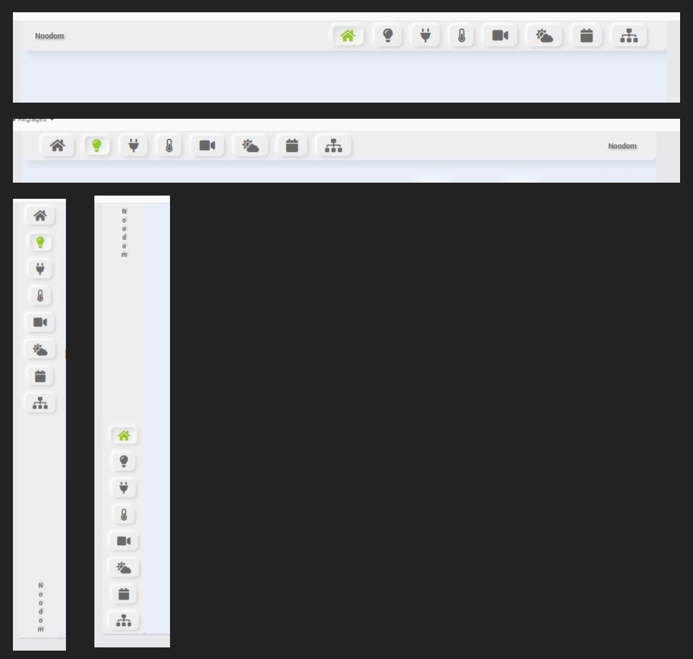

# Menu nooNeumorphism avec fichier de configuration JSon et gestion de navigation par Frame


Ce menu reprend le style neumorphique, les boutons du menu ayant  une couleur personnalisable pour le bouton courant et les autres boutons.

La personnalisation est effectuée depuis un fichier de configuration JSON (**html/data/menusNoodom/menuNooNeumorphism/js/perso.js**).

La navigation est effectuée en naviguant sur les designs correspondant à chaque bouton. 
Il y a la possibilité de naviguer à l'aide d'une frame, permettant de ne pas devoir recharger le menu à chaque changement d'écran.

## Installation du menu

### Avant d'inclure le menu, il faut commencer par les actions suivantes

   - Copier les dossiers **/data/menusNoodom/menuNooNeumorphism/css** et **/data/menusNoodom/menuNooNeumorphism/js** dans le répertoire **/html/data/menusNoodom/menuNooNeumorphism** à l'aide de l'éediteur de fichier (plugin jeeExplorer ou menu Réglages/Système/Editeur de fichiers à partir de Jeedom 4.2)

   - Editer le fichier **/js/perso.js** à l'aide de l'éditeur de fichier :
        - Pour chaque bouton du menu, mettre le libellé du bouton (**label**), le lien vers un design (**link**) et son icône fontawesome (**icon**)
        - Définir les positions et tailles des frames du menu et du contenu (détaillé ci-dessous)
   - (Optionnel) Vérifier que le fichier **/json/perso.js** modifié est correct :
        - Copier son contenu (en supprimant la première et dernière ligne du fichier et en supprimant les quotes en début et fin de lignes) ici : https://jsonlint.com/
        - Cliquer sur **'Validate JSON'**
        - Le résultat sous Results doit être vert avec le message **'Valid JSON'**

#### Création du menu

>**Note** :
>
>  Gestion par frame : 
>  - Un design contient le menu et les autres designs ne contiennent que le contenu des pages correspondantes à chaque bouton du menu (plus besoin d'inclure le menu sur chaque page)
> - **chargement des pages dans une FRAME** : code index.html du menu présent dans un seul Design

   - Créer un équipement htmlDisplay **'Contenu'** (depuis le plugin htmlDisplay) et copier le code de **menuFrame.html** dans l'onglet Dashboard (ne pas modifier 'menuFrame' pour un bon fonctionnement)
   - Créer un équipement htmlDisplay **'Menu'** (depuis le plugin htmlDisplay) et copier le contenu de **index.html** dans l'onglet Dashboard
        - Pour ces 2 équipements, cocher **'Activer'** et **'Visible'** puis **'Sauvegarder'**
   - Créer un seul nouveau Design de la largeur et de la hauteur de l'écran final (ordinateur, mobile, tablette, ..)
   - Créer un Design pour chaque lien des boutons du menu (Prévoir de respecter la taille du Design en fonction de l'affichage final dans la frame)
        - Ces menus ne contiennent pas le menu mais seulement les éléments de Jeedom à visualiser pour cet écran
        - Préciser ces liens dans le fichier de configuration **/js/perso.js** pour la navigation du menu si nécessaire
   - Ajouter EN PREMIER l'équipement htmlDisplay **'Contenu'** dans ce même Design  (menu clic-droit, sélectionner "ajouter équipement" et sélectionner le htmlDisplay 'Contenu')
        - Sa position et sa taille seront définies par les paramètres dans le fichier **/json/perso.js**
   - Ajouter EN SECOND l'équipement htmlDisplay **'Menu'** dans ce Design (menu clic-droit, sélectionner "ajouter équipement" et sélectionner le htmlDisplay 'Menu')
        -  Sa position et sa taille seront définies par les paramètres dans le fichier **/json/perso.js**
        - Adapter son z-index (clic droit, Paramètres d'affichage, profondeur : mettre niveau 3)
        - Cocher 'transparent' pour la couleur de fond (clic droit, Paramètres d'affichage, Couleur de fond : Transparent)
   - (Indépendant du menu) Ajouter les équipements à afficher dans chaque Design du menu (lumières, portes, fenêtres, volets, etc..)

#### Paramétrage du menu (modification du fichier /data/menusNoodom/menuNooNeumorphism/js/perso.js et SEULEMENT ce fichier)

   - **buttons** : liste des boutons du menu

   - **parameters** : liste des paramètres du menu

	********** Paramètres des boutons ***************
	   
	label : libellé du bouton

	label_first : 1 pour positionner  le label avant les boutons du menu, 0 pour positionner les boutons du menu avant le label
	
	link : identifiant du design destinataire du lien du menu (ex : 51 pour un design d'url http://www.monjeedom.com/index.php?v=d&p=plan&plan_id=51)
		
	icon : icône fontawesome pour l'affichage du bouton correspondant (ex : "fa fa-2x fa-home", liste à récupérer ici : https://fontawesome.com/icons?d=gallery&p=2&m=free)

	********** Paramètres du menu ***************
       
	label : libellé du champ à afficher dans le menu

	menu_x : position x du menu (par défaut "0px")

	menu_y : position y du menu (par défaut "0px")
        
	menu_width : largeur du menu (par défaut "1280px")
        
	menu_height : hauteur du menu (par défaut "80px")
        
	content_x : position x du contenu du menu (par défaut "0px")
        
	content_y : position y du contenu du menu (par défaut "0px")
        
	content_width : largeur du contenu du menu (par défaut "1280px")
        
	content_height : hauteur du contenu du menu (par défaut "1000px")

	cursor_color : affiche l'onglet 'Couleurs basiques' (par défaut '#96c927')
        
	cursor_default_color : couleur des éléments non sélectionnés du menu (par défaut 'dimgray')
        
	cursor_width : largeur des boutons du menu (par défaut '1.5rem')
        
	cursor_height : hauteur des boutons du menu (par défaut '0.5rem')

>**Note** :
>
>si la largeur du menu est supérieure à la hauteur du menu, le menu sera alors horizontal
>si la hauteur du menu est supérieure à la largeur du menu, le menu sera alors vertical

Pour information, les avantages de la gestion de la navigation du menu par frame :
- [x] Le code du menu est présent dans un seul Design : plus simple en cas de modifications nécessaires (un seul Design à modifier), pas de recopie nécessaire, pas d'oublis de modifications sur différents écrans
- [x] Les Designs de chaque bouton ne contiennent pas le code du menu :
- [x] On construit chaque écran lié à un bouton sans se soucier du menu choisi
- [x] On peut changer de menu sans modifier le contenu des écrans liés aux boutons : il suffit de créer autant de Design que de menus et ensuite, on appelle le design correspondant à un menu
   - Exemple : on crée un Design pour la navigation depuis un ordinateur, un autre menu pour une navigation depuis le mobile, un autre menu pour une navigation depuis une tablette.

>**Note** : il n'y a plus besoin de modifier le code (moins de risque d'erreur)
>
>Seul le fichier perso.js est à adapter à son menu

>### Création d'un équipement du plugin Html Display pour ajout dans un Design
>
>   - Depuis le plugin HTML Display, créer un nouvel équipement
>   - Recopier le contenu du fichier index.html dans cet équipement et sauvegarder
>   - Depuis un design, passer en mode édition (Clic droit, puis sélectionner 'Edition')
>   - Clic droit, puis sélectionner **'Ajouter équipement'**
>   - Sélectionner l'équipement HTML Display créé précédemment
>   - Redimensionner cet équipement

>**Note** : On aura au final l'arborescence suivante (A vérifier avec l'éditeur de fichiers) :
>
>- /html
>    - /data
>       - /menusNoodom
>          - /menuNooNeumorphism
>            - /css/perso.css, perso2.css, perso-v.css, perso2-v.css : les css du menu (Modification non nécessaire)
>            - /json/perso.js : le json de personnalisation du menu (A personnaliser)

Exemples de paramétrages :


- menu horizontal, boutons du menu à droite :

```
"label_first": "1",
"menu_width":"1280px",
"menu_height":"80px",
```

- menu horizontal, boutons du menu à gauche :

```
"label_first": "0",
"menu_width":"1280px",
"menu_height":"80px",
```

- menu vertical, boutons du menu à droite :

```
"label_first": "1",
"menu_width":"100px",
"menu_height":"1000px",
```

- menu vertical, boutons du menu à gauche :

```
"label_first": "0",
"menu_width":"100px",
"menu_height":"1000px",
```


