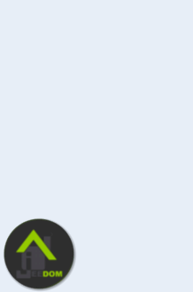

# Menu menuVerticalTom avec fichier de configuration JSon et gestion de navigation par Frame

Ce menu reprend le menu vertical de @Tom's avec :
- ajout de la gestion des boutons par un paramétrage JSon
- ajout de la navigation par frame à l'aide de htmlDisplay

La personnalisation est effectuée depuis un fichier de configuration JSON (**/html/data/menusNoodom/menuVerticalTom/json/perso.json**).

La navigation est effectuée en naviguant sur les designs correspondant à chaque bouton. 
Il y a la possibilité de naviguer à l'aide d'une frame, permettant de ne pas devoir recharger le menu à chaque changement d'écran.

## Installation du menu

▶️ Avant d'inclure le menu, il faut commencer par les actions suivantes

   - Créer le scénario d'installation automatique d'un menu noodom, si premier menu généré (disponible [ici](../installation/README.md))
      - Préciser le nom du menu **menuVerticalTom** dans le tag **menuName** du scénario (Détail des autres tags dans la procédure pour les autres tags)
      - Exécuter le scénario => Le design du menu est créé automatiquement
   - Editer le fichier **/html/data/menusNoodom/menuVerticalTom/json/perso.json** à l'aide de l'éditeur de fichier (plugin jeeExplorer ou menu Réglages/Système/Editeur de fichiers à partir de Jeedom 4.2) :
        - Pour chaque bouton du menu, mettre le lien vers un design (**link**) et le lien vers son image (**icon**)
   - Adapter si nécessaire les paramètres du menu et de la frame pour son affichage : voir détail plus bas
   - (Optionnel) Vérifier que le fichier **/html/data/menusNoodom/menuVerticalTom/json/perso.json** modifié est correct :
        - Copier son contenu ici : https://jsonlint.com/
        - Cliquer sur **'Validate JSON'**
        - Le résultat sous Results doit être vert avec le message **'Valid JSON'**

▶️ Création du menu
   - Créer un Design pour chaque lien des boutons du menu si pas encore existants (Prévoir de respecter la taille du Design en fonction de l'affichage final dans la frame)
      - Ces menus ne contiennent pas le menu mais seulement les éléments de Jeedom à visualiser pour cet écran
      - Préciser ces liens dans le fichier de configuration **/html/data/menusNoodom/menuVerticalTom/json/perso.json** pour la navigation du menu si nécessaire
   - (Indépendant du menu) Ajouter les équipements à afficher dans chacun des Designs liés aux boutons (lumières, portes, fenêtres, volets, etc..)

▶️ Paramétrage du menu (modification du fichier **/html/data/menusNoodom/menuVerticalTom/json/perso.json** et SEULEMENT ce fichier)
   - buttons : liste des boutons du menu
      - modifier les valeurs label (Libellé du bouton), link (lien vers l'id d'un design) et color (couleur du bouton) pour personnaliser les boutons du menu
   - parameters
      - init_close_menu : menu fermé au lancement du menu (par défaut "1")
      - auto_reduce_menu : menu se ferme sur sélection d'un bouton (par défaut "1")
      - opened_menu_opacity : opacité du contenu de la page si menu ouvert, en pourcentage (par défaut "20%")

      - menu_x : position x du menu (par défaut "0px")
      - menu_y : position y du menu (par défaut "280px")
      - menu_width : largeur du menu (par défaut "100px")
      - menu_height : hauteur du menu (par défaut "720px")
      - content_x : position x du contenu du menu (par défaut "0px")
      - content_y : position y du contenu du menu (par défaut "0px")
      - content_width : largeur du contenu du menu (par défaut "1280px")
      - content_height : hauteur du contenu du menu (par défaut "1000px")

>Pour information, les avantages de la gestion de la navigation du menu par frame (Solution 2) :
>	- Le code du menu est présent dans un seul Design : plus simple en cas de modifications nécessaires (un seul Design à modifier), pas de recopie nécessaire, pas d'oublis de modifications sur différents écrans
>	- Les Designs de chaque bouton ne contiennent pas le code du menu :
>		- On construit chaque écran lié à un bouton sans se soucier du menu choisi
>		- On peut changer de menu sans modifier le contenu des écrans liés aux boutons : il suffit de créer autant de Design que de menus et ensuite, on appelle le design correspondant à un menu
>			Exemple : on crée un Design pour la navigation depuis un ordinateur, un autre menu pour une navigation depuis le mobile, un autre menu pour une navigation depuis une tablette.

>**Note** : il n'y a plus besoin de modifier le code (moins de risque d'erreur)
>
>Seul le fichier **/html/data/menusNoodom/menuVerticalTom/json/perso.json** est à adapter à son menu

>### Création d'un équipement du plugin Html Display pour ajout dans un Design
>
>   - Depuis le plugin HTML Display, créer un nouvel équipement
>   - Recopier le contenu du fichier **index.html** dans cet équipement et sauvegarder
>   - Depuis un design, passer en mode édition (Clic droit, puis sélectionner 'Edition')
>   - Clic droit, puis sélectionner **'Ajouter équipement'**
>   - Sélectionner l'équipement HTML Display créé précédemment
>   - Redimensionner cet équipement

>**Note** : On aura au final l'arborescence suivante (A vérifier avec l'éditeur de fichier) :
>
>- /html
>    - /data
>        - /menusNoodom
>            - /menuVerticalTom  
>                - /css/perso.css : le css du menu (Modification non nécessaire)
>                - /img : les images du menu
>                - /json/perso.json : le json de personnalisation du menu (A personnaliser)
